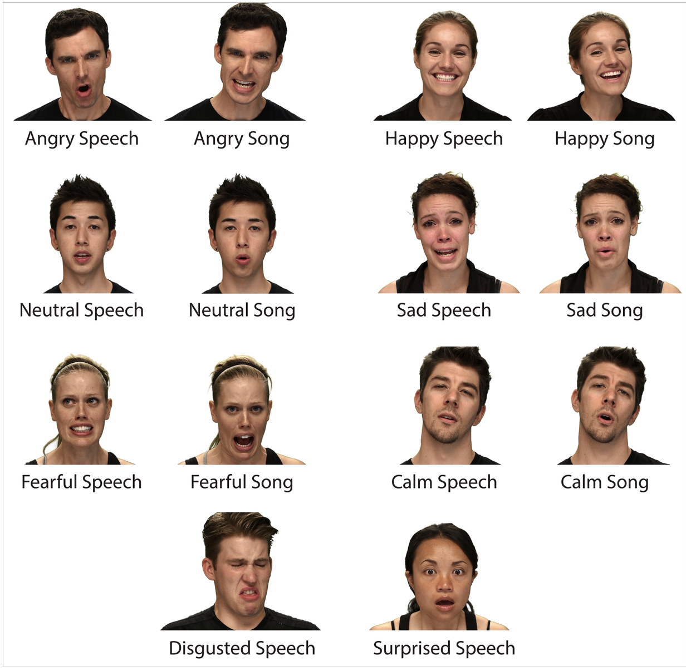
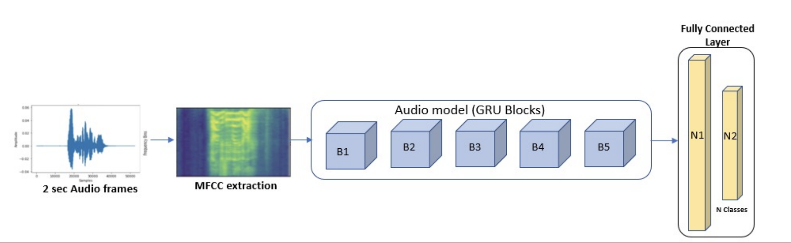
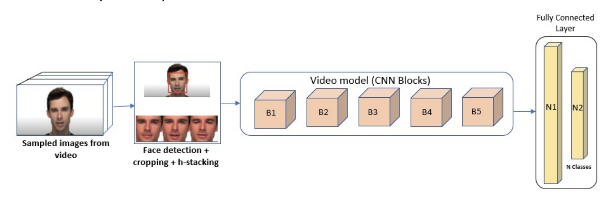
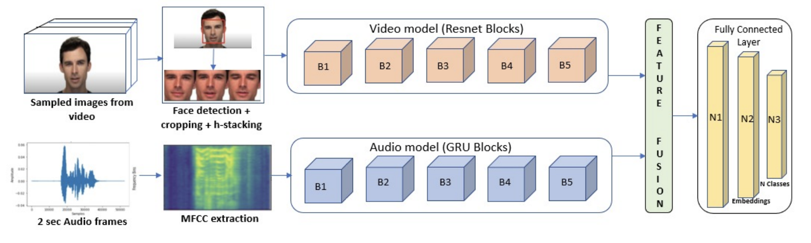
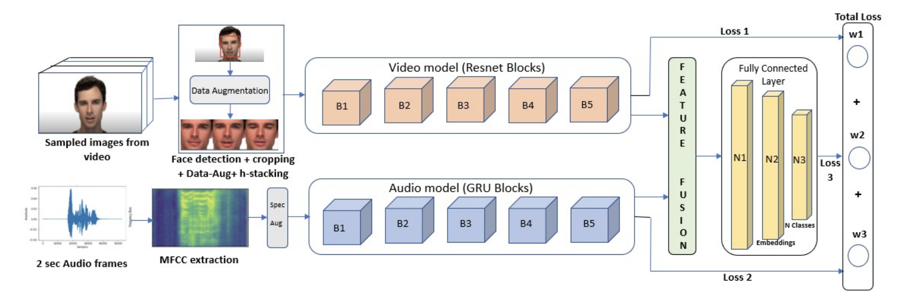

# Emotion-Recognition
### Abstract:
Detecting emotion in a continuous stream of data is a critical task to moderate and detect sentiment from audio-visual content. Automatic recognition of human emotions would help in teaching social intelligence to the machines, thereby help in detecting suicidal tendencies, anger, etc. It also helps in analysing mental states through emotional analysis and improve the quality of life. Using facial emotion detection in smart cars can alert the driver when he is frustrated or angry which can avoid any possible catastrophe. With this project my goal is to propose a novel multi-task learning methodology to leverage audio and visual modalities to build an emotion classifier. While unimodal emotion recognition is discriminative in predicting the emotion of a person, there is an added advantage in using a multimodal detection system in terms of the overall performance of the model where one modality will supplement the drawbacks of the other [Mou et al., 2019; Zhao et al., 2019] which in turn increases the performance of the model.

### Dataset Examples:

## Block Diagrams of the architecutures:
### Audio unimodal (V2):

### Video unimodal (V3):

### Audio-Video multimodal (V4):

### Audio-Video multimodal with regularization (V5):

